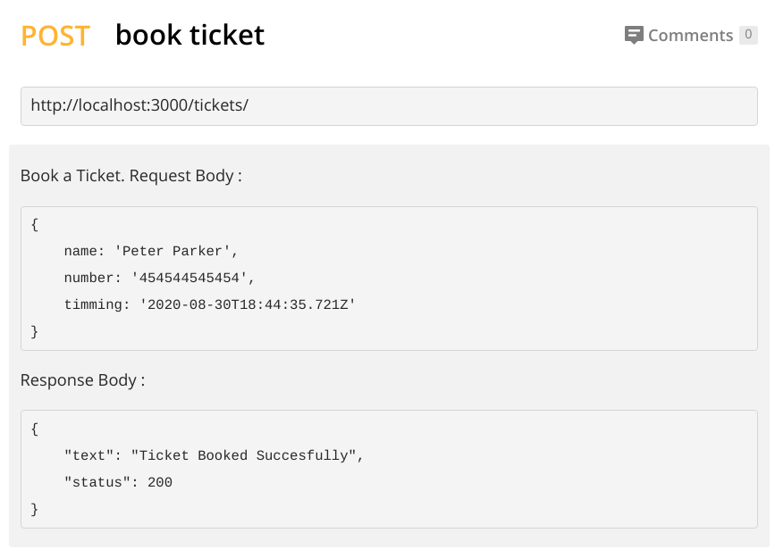
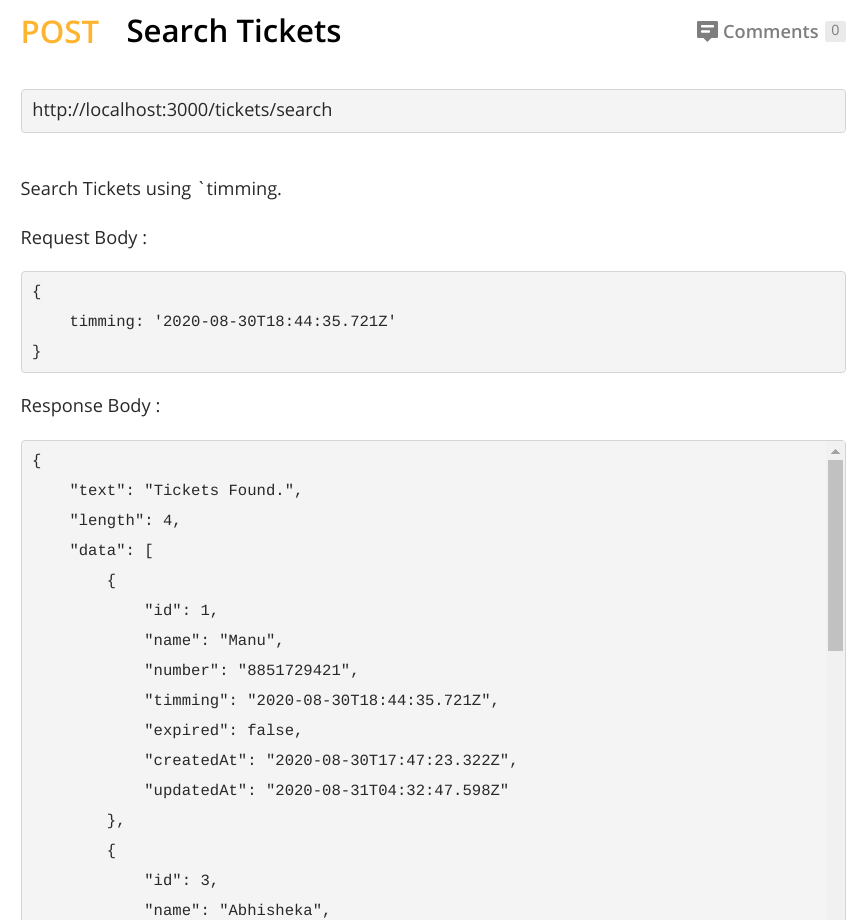
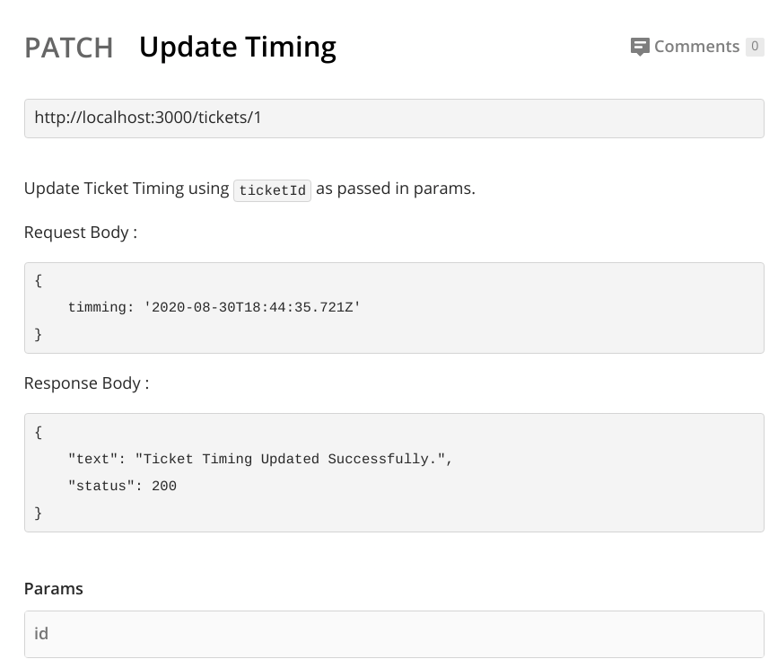
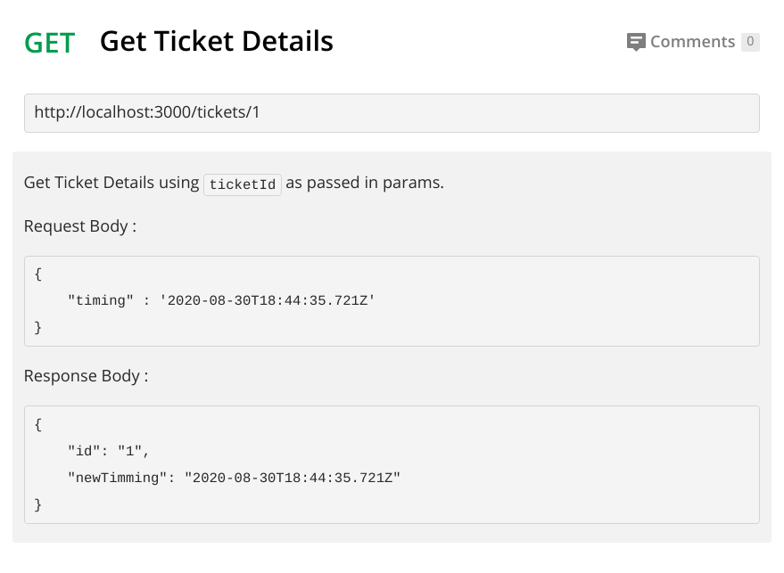
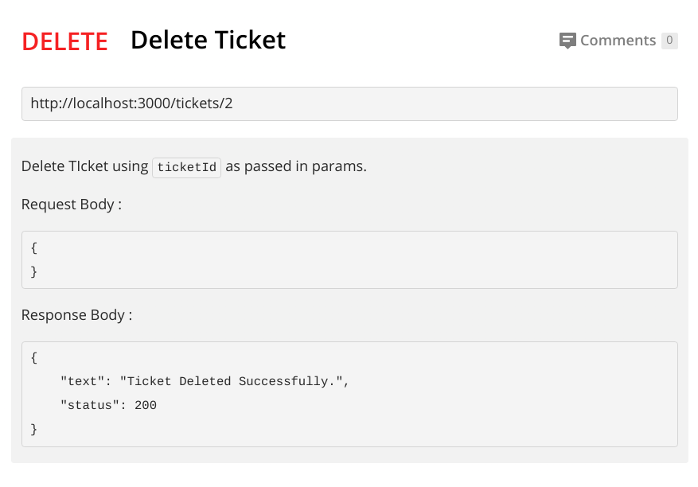
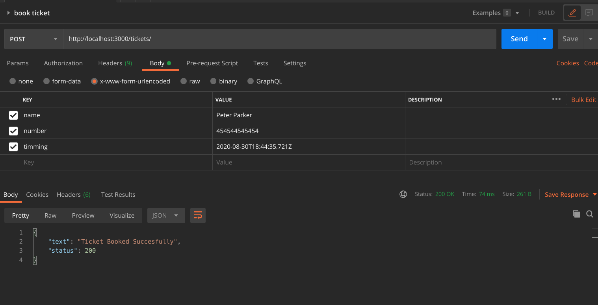
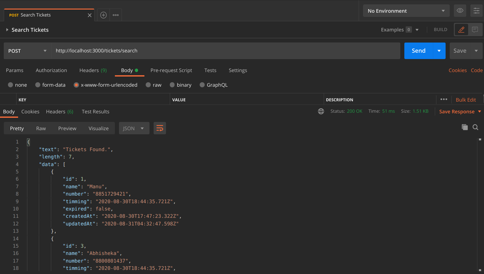
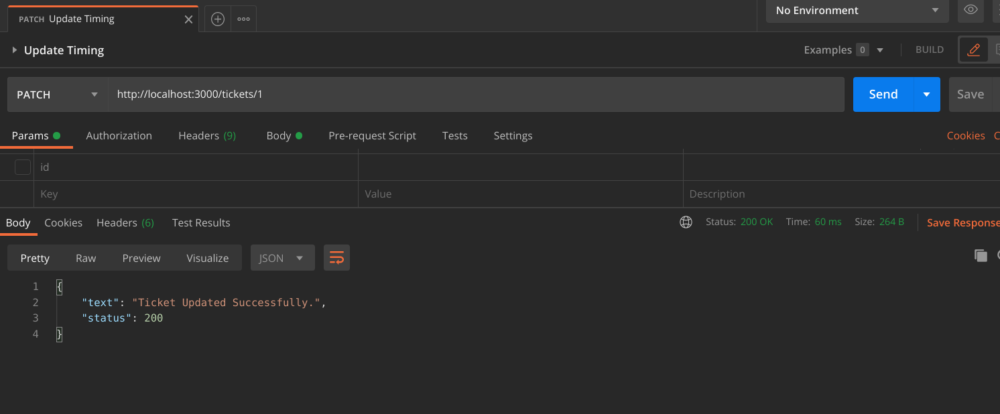
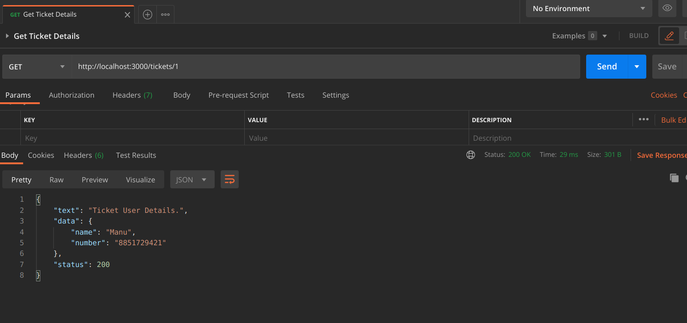
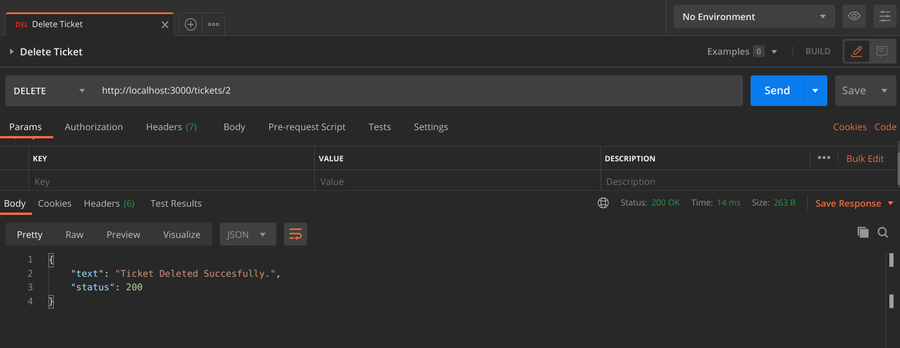

<h1 align="center">bespeak</h1>
<h4 align="center">Ticket Booking Interface</h4>
<p>

<p>
  <a href="https://www.npmjs.com/package/bespeak" target="_blank">
    
  </a>
  <a href="#" target="_blank">
    
  </a>
</p>


## Index

- [Index](#index)
- [About](#about)
- [Description of the Problem Statement](#description-of-the-Problem-Statement)
- [Usage](#usage)
  - [Prerequisites](#prerequisites)
  - [Setup](#setup)
  - [Database Schema](#database-schema)
- [Gallery](#gallery)
- [Endpoints](#endpoints)
- [Author](#author)


### 🏠 [Homepage](https://github.com/vmanav/bespeak#readme)

## About

bespeak is a REST API o movie ticket booking interface for *Zomentum Hiring Challenge*. It is built using Node.js, the database used is SQLite, It is a fully documented API.

## Description of the Problem Statement

You have to design a REST interface for a movie theatre ticket booking system. It should
support the following business cases:
- An endpoint to book a ticket using a user’s name, phone number, and timings.
- An endpoint to update a ticket timing.
- An endpoint to view all the tickets for a particular time.
- An endpoint to delete a particular ticket.
- An endpoint to view the user’s details based on the ticket id.
- Mark a ticket as expired if there is a diff of 8 hours between the ticket timing and current
time.

- Note: For a particular timing, a maximum of 20 tickets can be booked.
- You should follow the REST paradigm while building your application.
- You can use any database you like.
- Create a proper readme for your project.
- Plus point if you could delete all the tickets which are expired automatically.
- Plus point if you could write the tests for all the endpoints.
- Please attach a screenshot of your postman while testing your application.
- Please avoid plagiarism.


## Usage

### Prerequisites 

* Node.js installed.

### Setup

1. Fork the repository and clone it to your local machine.
1. `cd` into the directory `bespeak` 
1. Install Dependencies with
    ```sh
    npm i
    ```
1. Start the application
    ```sh
    node server.js
1. The interface will be live at http://localhost:3000.

### Database Schema

| Field | DataType  | AllowNull | Comments |
| :---:   | :-: | :-: | :-: |
| id | INTEGER  | NA | primaryKey |
| name | STRING  | false | User Name |
| number | STRING  | false | User Contact Number |
| timming | DATE  | false | Show Timming |
| expired | BOOLEAN  | false | Validity |


## API Endpoints

||
|:-------:|
|*Home Page*|

|*Book Ticket*|

|*Search Tickets*|

|*Update Ticket*|

|*Get Ticket Details*|

|*Delete Ticket*|


## Gallery

||
|:-------:|
|*Home Page*|

|*Book Ticket*|

|*Search Tickets*|

|*Update Ticket*|

|*Get Ticket Details*|

|*Delete Ticket*|


## Author

👤 **Manav Verma**

* Github: [@vmanav](https://github.com/vmanav)

## Show your support

Give a ⭐️ if this project helped you!
